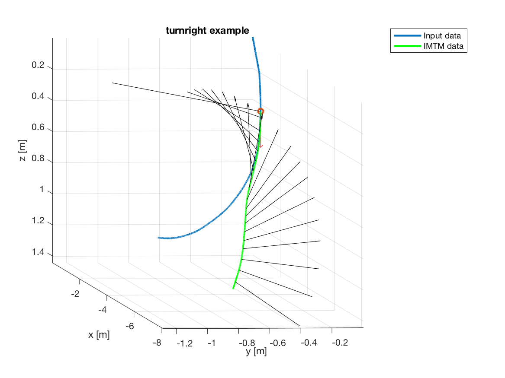

# IMtrajectoryModel
[](https://travis-ci.org/geo-fluid-dynamics/im-trajectory-model)

A tool that converts heater state changes of a maneuverable melting probe to a trajectory.

The heater state changes can be provided by two possible input files, namely a logfile and a simplified logfile. An example for a logfile is given by `test/logfile/icemole_state.log`. Examples for simplified logfiles can be found in `test/simplifiedLogfile/`.

[Geo Fluid Dynamics](https://blog.rwth-aachen.de/gfd/) - A research group at RWTH Aachen University<br>
Author: K. Schüller schueller@aices.rwth-aachen.de

## Dependencies
* [CMake](https://cmake.org)

## Getting Started
To build IMtrajectoryModel, create a build folder in the root directory
```
mkdir build
cd build
```
Then execute
```
cmake ..
make
```
To make sure that everything works as expected, you can run the tests by
```
make test
```
Run
```
./IMtrajectoryModel -h
```
to see all possible input options.

In order to use IMtrajectoryModel to calculate a melting trajectory from a logfile that includes heater states of a melting probe you can run
```
./IMtrajectoryModel -l LOGFILE -i INPUTFILE -o OUTPUTFILE
```
or for a simplified logfile that contains less information (see `test/` for examples how those files should look like)
```
./IMtrajectoryModel -sl LOGFILE -i INPUTFILE -o OUTPUTFILE
```
in which `LOGFILE` is the location of the logfile that contains the heater states, `INPUTFILE` the location of the input file (e.g. inputs.ini) and `OUTPUTFILE` is the location where to save the melting trajectory.

## Examples


## Models
The models can be selected in the input file. Currently, there is only one model for curvilinear melting.
### Straight melting models
* Energy balance
* Improved analytical solution based on close-contact melting theory
### Curvilinear melting models
* Energy balance

## Coordinate System (COS)
### Melting Probe COS (local COS)
The IDs of the heating cartridges in the melting head and wall heaters are used to define the melting probe COS as shown in the following schematic (note that the viewer looks from the back of the melting probe to the melting direction)


### Ice COS (global COS)
The global COS (x-, y- and z-direction) is connected to the melting probe COS by the initial normal vector `n_0` and the initial tangent vector `t_0`, which can be set by the user. By default `n_0=(1,0,0)` and `t_0=(0,0,-1)`, which means that the local coordinates `X` and `Y` are aligned to the gloabal coordinates `x` and `y`. Further examples:
* n_0=(-1,0,0),t_0=(0,0,-1): X aligns with -x, Y aligns -y
* n_0=(0,1,0),t_0=(0,0,-1): X aligns with y, Y aligns -x
* n_0=(0,0,1),t_0=(1,0,0): X aligns with z, Y aligns y

## Heater States
| Heater Name | Position in heater state array |
| --- | --- |
| Head Heater 1 | 1 |
| Head Heater 2 | 2 |
| Head Heater 3 | 3 |
| Head Heater 4 | 4 |
| Head Heater 5 | 5 |
| Head Heater 6 | 6 |
| Head Heater 7 | 7 |
| Head Heater 8 | 8 |
| Head Heater 9 | 9 |
| Head Heater 10 | 10 |
| Head Heater 11 | 11 |
| Head Heater 12 | 12 |
| Head Heater 13 | 13 |
| Head Heater 14 | 14 |
| Head Heater 15 | 15 |
| Head Heater 16 | 16 |
| Wall Heater 1 | 17 |
| Wall Heater 2 | 18 |
| Wall Heater 3 | 19 |
| Wall Heater 4 | 20 |
| Wall Heater 5 | 21 |
| Wall Heater 6 | 22 |
| Wall Heater 7 | 23 |
| Wall Heater 8 | 24 |

## Postprocessing
The trajectory given in the output file after successful execution of IMtrajectoryModel is given by

| time | px | py | pz | tx | ty | tz | nx | ny | nz | distance | nx_fixed | ny_fixed | nz_fixed |
| --- | --- | --- | --- | --- | --- | --- | --- | --- | --- | --- | --- | --- | --- |
| 0 | px_0 | py_0 | pz_0 | tx_0 | ty_0 | tz_0 | nx_0 | ny_0 | nz_0 | 0 | nx_fixed_0 | ny_fixed_0 | nz_fixed_0 |
| ... | ... | ... | ... | ... | ... | ... | ... | ... | ... | ... | ... | ... | ... |

in which<br>
  **time**        is the time in seconds strating from 0<br>
  **px, py, pz**  is the position in meter<br>
  **tx, ty, tz**  is the tangential vector of the trajectory in meter<br>
  **nx, ny, nz**  is the normal vector of the trajectory in meter<br>
  **length**      is the total molten length (arc length) of the trajectory<br>
  **nx_fixed, ny_fixed, nz_fixed** is the normal vector that does not flip due to a heater activity change in the melting head (can be used e.g. for visualization)

## Miscellaneous
* `tau` is the torsion, given in rad/m. With defining tau, the user can set the rotation around the melting probes' main axis. E.g. if the melting probe should rotate 180° every 2 meter, `tau` is simply pi/(2 m).
* If computing time is an issue, the user can prevent calculating the arc length of the trajectory using the `--distance` option with the value `0`. The resulting output will still contain the column `distance` but with all values set to `-1`.

## Limitations/Problems
